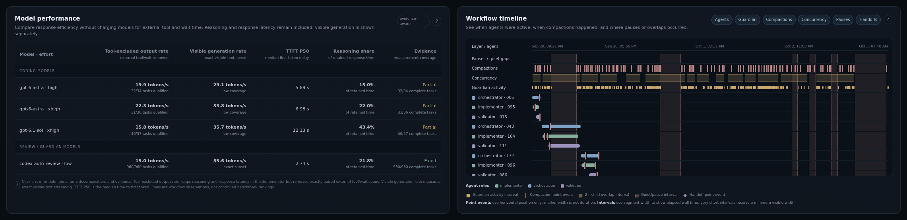

# Codex Quota Audit

Codex Quota Audit turns your local Codex session logs into interactive reports. Compare how much work different models get from your quota, and see where agent workflows spend tokens and time.

The analysis runs locally, and the generated HTML works offline. Standard reports leave out prompts, responses, tool output, and raw session IDs.

## Demo

Explore a real workflow report covering **September 29–October 3, 2026**: model performance, response timing, work by role, agent timelines, and context compactions.

[](https://dayowe.github.io/codex-quota-audit/)

[**Open the interactive demo →**](https://dayowe.github.io/codex-quota-audit/)

## Why use it?

Use the reports to investigate questions such as:

- **Which model and reasoning effort get more work from my quota?** Compare observed tokens and price-normalized work per quota point, with evidence coverage visible.
- **Has quota efficiency changed over time?** Inspect historical trends and detected policy regimes instead of mixing incompatible periods into one average.
- **How much work does Approve for me / Guardian add?** Separate auto-review inference from ordinary agent work and inspect estimated quota overhead.
- **Does a banked reset provide comparable capacity?** Supply reset timestamps you personally confirmed, then compare matched periods and equal quota slices before and after each reset.
- **Where does an agent workflow spend its work and time?** Explore roles and individual agents, model response timing, overlapping lifetimes, context growth, and compactions on an interactive timeline.

Quota reports relate observed usage to the rate-limit meter. Workflow reports explain usage within a session or linked agent tree; they work with solo sessions, unnamed workers, and nested teams. No special agent architecture or labeling convention is required.

## Get started

You need **Python 3.10 or newer** and existing local Codex session logs, normally under `~/.codex`. Run CQA on the machine that holds those logs. The plugin also requires the Codex CLI with plugin support.

### Recommended: install the Codex plugin

Register the marketplace and install the plugin:

```bash
codex plugin marketplace add dayowe/codex-quota-audit --ref main
codex plugin add codex-quota-audit@dayowe
```

Start a **new Codex thread**, then ask:

> Build my Codex quota dashboard.

> Profile my latest multi-agent workflow.

The plugin bundles the analyzers, so there is no separate Python package installation. Python must still be available as `python3` on Linux/macOS or `python` on Windows.

The first request builds a quota report. The second selects a workflow with recorded delegated worker usage, excluding Guardian-only activity and the current Codex session when its ID is available. Reports are saved locally and opened in your browser.

### Alternative: use the standalone CLI

Install from a repository checkout in a virtual environment:

```bash
git clone https://github.com/dayowe/codex-quota-audit.git
cd codex-quota-audit
python3 -m venv .venv
source .venv/bin/activate
python3 -m pip install .
cqa dashboard
```

This builds your first quota dashboard and opens it in the default browser. The core analyzers and HTML reports need no third-party runtime dependencies. PyPI installation is not currently offered; use the checkout above.

See the [usage guide](docs/usage.md#installation) for Windows PowerShell setup and optional publication charts.

## Everyday use

With the standalone CLI installed:

| What you want to do | Command |
| --- | --- |
| Build a quota dashboard | `cqa dashboard` |
| Add the latest inspectable workflow | `cqa dashboard --workflow latest` |
| Profile the latest multi-agent workflow | `cqa workflow profile latest --multi-agent-only` |
| Choose a particular session or agent family | `cqa workflow candidates`, then `cqa workflow profile ID` |
| Print quota history and detected regimes | `cqa audit --history` |
| Revisit saved reports | `cqa reports` |

The broad CLI `latest` selector can fall back to a solo session. Use `--multi-agent-only` for a workflow report, or `--workflow-multi-agent-only` with a combined dashboard, to require delegated workers.

Reports open as self-contained HTML with clickable charts, tables, timelines, and evidence drawers. Quota and workflow sections expose different questions; missing evidence is labeled unavailable rather than displayed as zero.

Normal runs archive reports under `~/.codex/codex-quota-audit/reports/`. Stable copies live in `latest/quota.html`, `latest/workflow.html`, and `latest/combined.html`. Run `cqa reports list` for a terminal list or `cqa reports open latest-workflow` to reopen a report without analyzing the logs again.

Useful options include `--home /path/to/.codex` for another log directory, `--no-open` for headless runs, and `--report-json` to keep the machine-readable report alongside the HTML. Use `cqa --help` or a command's `--help` for its options, and `cqa --version` to see package and analyzer versions.

The [usage guide](docs/usage.md) covers exports, banked-reset timestamps, role declarations, pause review, and detailed analysis commands.

## Privacy and interpretation

CQA's analyzers make no network requests and do not edit your source logs. The dashboard has no external scripts, fonts, analytics, or other network dependencies. Standard HTML/report JSON excludes conversation contents, account credentials, source paths, and raw session/thread IDs; workflow agents receive report-local identifiers.

Reports still describe your activity. Review timestamps, usage patterns, and any labels you supply before sharing. The local catalog and raw-log research staging are separate from the portable report privacy contract. See the [privacy model](docs/privacy.md) for details.

Keep these limits in mind:

- **More observed work does not establish better results.** Tokens, overlap, context growth, and validation effort do not by themselves prove waste or achievable savings.
- **API$eq is a comparison unit.** Price-normalized work is not your subscription bill, OpenAI's internal cost, or the actual quota formula.
- **The evidence is observational.** Meter readings are coarse; workload, policy periods, and incomplete logs can affect comparisons. Guardian quota attribution is an estimate with uncertainty.
- **Timing metrics answer different questions.** Visible generation, time to first token, tool-excluded output rate, and whole-workflow pace use different denominators. Inspect the report's metric guides and coverage before comparing models.

## Further documentation

- [Usage guide](docs/usage.md) — installation, common tasks, exports, roles, and pause review.
- [Quota methodology](docs/quota-methodology.md) — meter accounting, replay filtering, Guardian, banked resets, and pricing.
- [Workflow methodology](docs/workflow-profiler.md) — attribution, lifetimes, concurrency, compactions, and timing definitions.
- [Privacy model](docs/privacy.md) and [report contract](docs/cqa-report-v1.md) — what portable reports contain.
- [Development and releases](docs/development/releasing.md), [architecture](docs/architecture.md), and [plugin packaging](docs/plugin.md) — working on the project.
- [Throughput research](docs/research/throughput.md) — comparing timing metrics over the same logs.

Released under the [MIT license](LICENSE).
