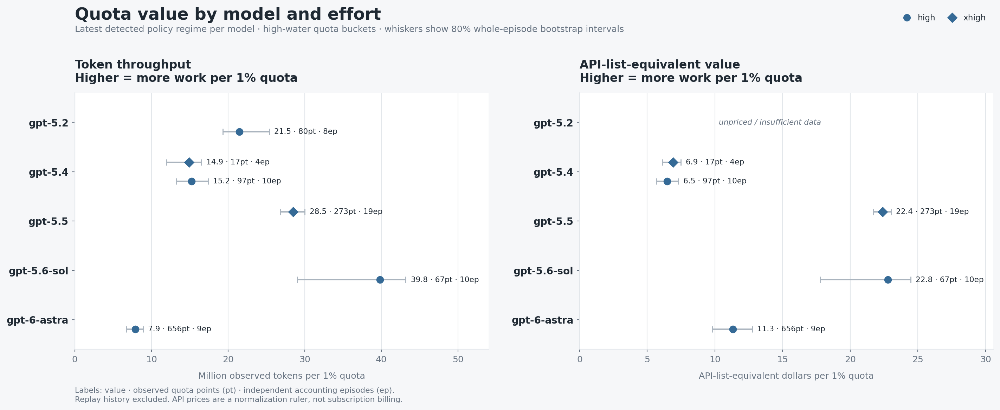
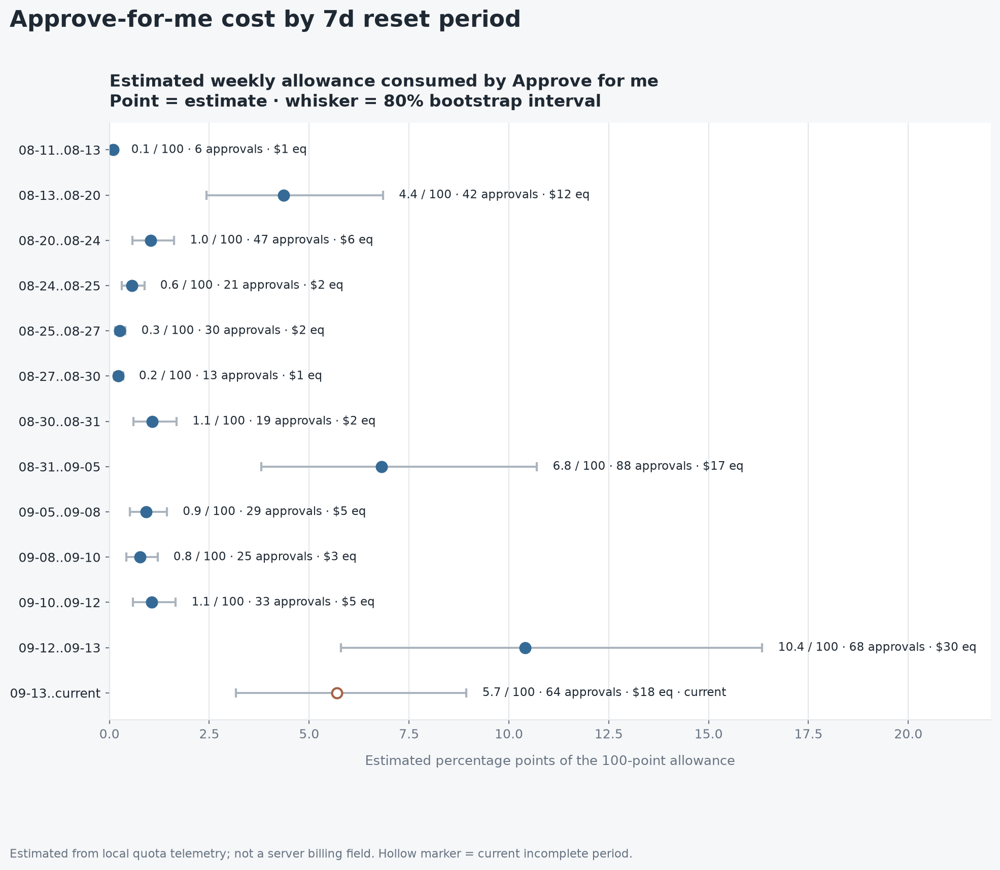
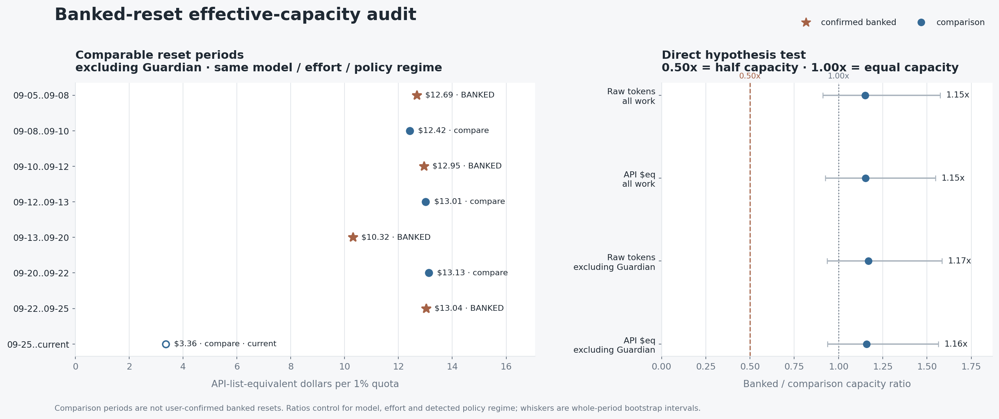
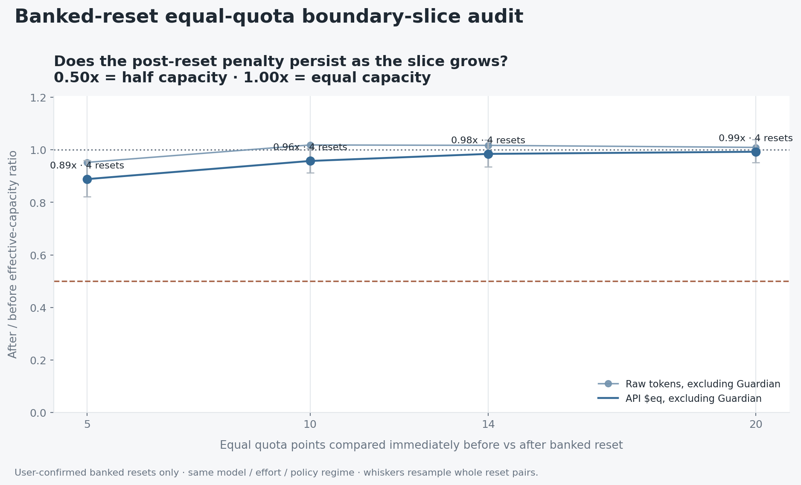

# Codex Quota Audit

**How much Codex work does your quota actually buy?**

`Codex Quota Audit` analyzes your local Codex session logs to measure quota efficiency across models, reasoning-effort levels, and time. The preferred interfaces are the Codex plugin and the `cqa` CLI. Historical direct-script wrappers are kept under `compat/` for maintainers, but application code lives in `src/cqa`.

It can help answer questions such as:

- Which model and reasoning-effort combination gives me the most work per 1% of quota?
- Did Codex quota generosity change over time?
- How much extra inference did **Approve for me / Guardian** create?
- How much of each 7-day allowance was plausibly spent on auto-review?
- Do user-confirmed **banked resets** provide less effective capacity than comparable reset periods?
- Does the same number of quota points buy less work immediately after a banked reset?
- Are replayed rollout histories or stale quota readings distorting a simple tokens-per-percent calculation?
- Where inside a multi-agent workflow are orchestration, implementation, validation, context rereads, and re-entry consuming the most work?

The analyzers read local Codex JSONL telemetry under `~/.codex`, reconstruct effective quota accounting periods, filter replayed history, and relate observed token usage to the Codex rate-limit meter.

**Nothing leaves your machine.**

> [!IMPORTANT]
> This is an empirical analysis of local telemetry. It is not documentation of OpenAI's internal quota formula, billing system, or compute costs.

## Demo

Explore a real workflow report covering **September 29–October 3, 2026**: model performance, response timing, work by role, agent timelines, and context compactions.

[](https://dayowe.github.io/codex-quota-audit/)

[**Open the interactive demo →**](https://dayowe.github.io/codex-quota-audit/)

---

## Codex plugin

The repository now includes a self-contained Codex plugin with two skills: `quota-audit` and `workflow-profile`. Install the repository marketplace and then the plugin:

```bash
codex plugin marketplace add dayowe/codex-quota-audit --ref main
codex plugin add codex-quota-audit@dayowe
```

Start a new Codex thread after installation. You can then ask naturally for things such as **“Build my Codex quota dashboard”**, **“Analyze Guardian and these banked reset timestamps”**, or **“Profile my latest multi-agent workflow.”** The plugin delegates to the same local analyzers documented below; it has no remote service and keeps the standard dashboard/report local. See [`docs/plugin.md`](docs/plugin.md) for packaging, privacy, and development details.

---

## Quick start

### Recommended: Codex plugin

For Codex users, the plugin is the primary installation experience and is deliberately **one step after marketplace registration**: no separate Python package installation is required.

```bash
codex plugin marketplace add dayowe/codex-quota-audit --ref main
codex plugin add codex-quota-audit@dayowe
```

Start a new Codex thread and ask **“Build my Codex quota dashboard”** or **“Profile my latest multi-agent workflow.”** For the latter, the plugin uses a strict selector: it requires delegated non-Guardian worker usage, excludes the currently running Codex session when Codex exposes its thread/session ID, and archives the workflow report in the local CQA report library under `~/.codex/codex-quota-audit/`, while maintaining `latest/workflow.html`. It does not silently fall back to the dashboard session, Guardian-only activity, or a standalone session.

### Standalone CLI from a checkout

For terminal use, the repository is also a normal Python package:

```bash
python3 -m pip install .
cqa dashboard
```

PyPI publication is intentionally deferred; installing from a checkout is the supported standalone-package path for now.

`cqa dashboard` archives a self-contained dark-theme dashboard in `~/.codex/codex-quota-audit/reports/`, updates `latest/quota.html`, and opens the archived report in your default browser. Use `--no-open` for headless/agent runs:

```bash
cqa dashboard --no-open
```

To include the most recent inspectable workflow automatically:

```bash
cqa dashboard --workflow latest
```

The standalone `cqa dashboard --workflow latest` selector remains broad: it prefers linked multi-session workflows with observed usage and can fall back to a standalone session when no linked workflow is available. Use `--workflow-multi-agent-only` when you want the same strict semantics as the plugin. To keep the machine-readable contract too:

```bash
cqa dashboard --workflow latest --report-json
```

Useful commands are:

```bash
cqa audit --history
cqa workflow candidates
cqa workflow profile latest
cqa workflow profile latest --multi-agent-only
cqa reports
cqa reports list
cqa report validate ~/.codex/codex-quota-audit/latest/quota.json
cqa research throughput-compare latest
```

From a source checkout, install with `python3 -m pip install .` and use `cqa`. Historical direct-script wrappers are isolated under `compat/` and are not part of the primary interface.

### Development / release gate

The project intentionally does not require a hosted CI pipeline at this stage. Before a release candidate, run the deterministic local gate:

```bash
python3 tools/release_check.py
```

It covers the complete test suite, analyzer self-tests, plugin launchers, privacy canaries, compile checks, and an offline wheel build/import smoke. Each subprocess stage is time-bounded and reports elapsed time; failures include captured diagnostics instead of silently hanging. See [`docs/development/releasing.md`](docs/development/releasing.md) and [`docs/privacy.md`](docs/privacy.md).

Long workflow profiles also show concise progress by default (scan/parse counts plus analysis/render stages). Use `--quiet` for script-friendly final-path-only output, or `--show-analysis-output` when the underlying profiler's detailed diagnostics are useful. Progress never invents percentages or ETAs.

### Direct analyzer CLI

The underlying quota analyzer is available through the unified CLI:

```bash
cqa audit --dashboard
```

This writes the same self-contained report format to:

```text
~/.codex/codex-quota-audit/report.html
```

The dashboard has no CDN, analytics, remote fonts, or network dependencies. Its embedded data is the privacy-safe `cqa-report-v1` contract; the browser only renders already-computed results.

To keep the machine-readable contract as well:

```bash
cqa audit \
  --report-json cqa-report.json \
  --dashboard
```

For the traditional quota analysis and publication charts:

```bash
cqa audit --charts
```

This prints the highest-value findings and creates publication-ready PNG/SVG charts.

### Include workflow-profiler evidence

The workflow profiler can now render the same dashboard contract directly:

```bash
python3 -m cqa.workflow.profile \
  --family W-YOUR_WORKFLOW \
  --dashboard \
  --report-json workflow-report.json
```

`python3 -m cqa.workflow.profile --export-json` remains the detailed, privacy-safe profiler format for advanced/debug use. `--report-json` is the normalized `cqa-report-v1` presentation contract.

To combine quota and workflow analysis in one dashboard, first produce the detailed workflow profile, then attach it to the quota report:

```bash
python3 -m cqa.workflow.profile \
  --family W-YOUR_WORKFLOW \
  --export-json workflow_cost_profile.json

cqa audit \
  --dashboard \
  --workflow-profile-json workflow_cost_profile.json
```

`--workflow-profile-json` is repeatable. Combined reports expose a workflow selector in the dashboard. Workflow identifiers are remapped to report-local IDs (`workflow-...`, `agent-...`, `agent-window-...`, `compaction-...`, `handoff-...`) before they enter the shared dashboard contract.

### Dashboard history and workflow timeline

The dashboard includes a first-class **History & regimes** view. Detected model-specific policy-regime windows share one time axis; selecting a regime filters the quota-efficiency cohort view without changing the report or recomputing analysis.

Workflow profiles include a layered timeline built entirely from `cqa-report-v1`. Layers can independently show trusted agent lifetimes, Guardian activity bursts, compactions, 2+ child concurrency, reviewed quiet/pause intervals, and profiler handoffs. Compactions and handoffs are point events: their horizontal position is meaningful, but marker width is not duration. Guardian activity, trusted agent lifetimes, concurrency, and pause bands are elapsed-time intervals; very short intervals receive a minimum visible width. Guardian burst width represents first-to-last-request elapsed time, not continuous model inference. Timeline elements support keyboard activation and open evidence drawers. The drawer traps keyboard focus while open, and the dashboard honors reduced-motion preferences.

### Workflow model performance and pace

Workflow reports separate **Model performance**, **Response timing**, **Work by role / Workflow pace**, and **Agent activity**. The dashboard keeps established performance terminology visible and explains it in place: **Tool-excluded output rate** is the primary response-efficiency measure, **Visible generation rate** is the complementary exact-attribution decoder-speed measure, **TTFT** means Time to First Token, **P50** is the median, and **P90** is the 90th percentile. Table headers and timing cards pair the canonical terms with short descriptions such as “median first-token delay,” while one-click metric guides provide the exact denominators and evidence rules. The model drawer keeps percentage denominators explicit and shows response time in two stages: total task time → external tool/wait vs retained response time, then retained response time → timed reasoning, visible generation, and other retained time.

The underlying primary metric is unchanged: response-level non-reasoning model output divided by observed task time after exactly paired external tool/wait spans are removed. Reasoning, TTFT/request latency, model-resume latency, visible generation, and model-generated tool-call output remain charged to the model. Evidence remains Exact / Partial / Unavailable and model/effort rows remain observational rather than controlled benchmark rankings.

Visible generation remains response-scoped and unchanged: CQA pairs timed visible `AgentMessage` item(s) with response-level token usage, sums multiple visible-message durations, excludes mixed visible+tool-call responses, and never lets `function_call_output` / `custom_tool_call_output` contaminate the following response. Low-coverage cohorts are flagged; defensible small-sample rates stay numeric with evidence labels, while truly unavailable evidence remains unavailable rather than becoming zero. Review/Guardian rows stay visually separated because their workload shape is not a controlled like-for-like benchmark.

TTFT remains a distinct responsiveness diagnostic even though it contributes to tool-excluded task time. Current rollout telemetry records one TTFT per Codex task/turn (turn start → first model token); it does not provide TTFT for every later model response inside a tool-heavy turn. End-to-end task duration remains lifecycle context rather than server-internal inference time.

The separate **Workflow pace** view retains observed turn cadence by **role**, **model**, and privacy-safe **agent**, together with tokens/turn, active-interval token-work rate, and **Model output per minute**. The elapsed-output rate is response-level model output attributed to the group divided by the full workflow analysis-window wall time; its denominator intentionally includes tools, orchestration, waits, subagents and scheduling, so it is not generation speed. Root/child position is shown separately from semantic role in report/dashboard presentation. One turn is one deduplicated Codex usage sample. Cadence uses adjacent turns inside the configured `--burst-gap-seconds` threshold and can include tool execution, orchestration and waiting, so it must not be interpreted as model inference latency or decoding speed.

Model-performance aggregates are weighted from total qualified output tokens and total qualified generation time; latency uses distributions rather than arithmetic means. Every timing metric carries sample/coverage information. See [`docs/workflow-profiler.md`](docs/workflow-profiler.md) for the exact definitions and caveats.

### Research: compare generation throughput semantics

For methodology work, `cqa research throughput-compare ID` compares three deliberately different timing semantics over the same local Codex logs: production CQA **visible-generation tok/s**, a separately labelled **Tokscale-style** accounting-interval reconstruction, and research-only **tool-excluded response throughput**. The last metric keeps reasoning/TTFT/model-side elapsed time in the denominator while subtracting exactly paired model tool-call → tool-result spans, so external tool execution/waiting does not dilute the model-side rate. The research artifact emits only report-local session references and does **not** alter the dashboard or `cqa-report-v1.0`. By default it writes privacy-safe JSON and CSV under `~/.codex/codex-quota-audit/research/`.

To validate the Tokscale reconstruction against upstream Tokscale on the **exact same selected rollout population**, add `--stage-tokscale-home PATH`. CQA creates a local-only Codex home containing only those raw rollout files, then prints the upstream command using `CODEX_HOME=PATH`. The staging directory is deliberately **not** privacy-safe: it contains raw Codex rollout content/filenames and must not be uploaded or shared. See [`docs/research/throughput.md`](docs/research/throughput.md) for formulas, staging behavior, privacy guarantees, upstream references, and interpretation limits.

### Local report library

Normal `cqa` runs no longer overwrite one fixed HTML file. Reports are archived locally under `~/.codex/codex-quota-audit/reports/`, while stable copies under `latest/` make automation predictable. Run `cqa reports` to open the local browser library or `cqa reports list` for a terminal list. Workflow filenames use the analyzed workflow start date plus a short privacy-safe workflow reference; `--name "Big frontend migration"` can add an optional recognition label at creation time. No rename subsystem or raw Codex session IDs are used in shareable filenames.

### Profile a session or agent workflow

For workflow costs, start with any session ID from the run you want to inspect:

```bash
python3 -m cqa.workflow.profile \
  --session YOUR_SESSION_ID \
  --export-json workflow_cost_profile.json
```

This works with solo sessions, unnamed workers, flat teams and nested agent trees.
No staged-implementation skills, special agent names or project configuration are
required. The default **generic** profile reports observed usage, context growth,
compactions and linked parent/worker activity without assuming a plan → implement
→ validate sequence. Missing linkage or roles are reported as limitations.

If you do not know the session ID, run `cqa workflow candidates` and
choose a reported `W-...` family or `S-...` session key. A session selector resolves
the containing family; use `--analysis-root YOUR_SESSION_ID` as well to select only
that session's observed subtree.

Workflow analysis uses the Python standard library. The canonical implementation is the
`cqa` package under `src/cqa/`. `pyproject.toml` installs that package for standalone use.
The Codex plugin keeps a generated, release-checked runtime mirror under
`plugins/codex-quota-audit/runtime/cqa/` so plugin installs remain self-contained without
creating a second independently editable implementation.
It reads local logs under `~/.codex`; `--home /path/to/codex-home` selects another log
location. It makes no network requests. JSON/HTML output is optional.

Long breaks can lower tokens/hour without improving the workflow. The profiler
flags quiet intervals; [pause review](#quiet-intervals-and-confirmed-pauses) lets you
confirm them once and reuse the decisions without rescanning logs during review.

**API$eq is a comparison measure, not your subscription bill or quota consumption.**
Raw tokens, cached input and price coverage remain visible. Reports cannot establish
that observed overlap, context growth or validation effort was unnecessary.

For a known implementation/validation workflow, add `--workflow-profile staged`.
For other role names, see [Custom workflows](#custom-workflows). Neither option
changes which roles count toward core token totals or concurrency.

For practical setup and interpretation, see
[Getting useful results and identifiable roles](#getting-useful-results-and-identifiable-roles).

### Install chart support

Text analysis uses only the Python standard library. Charts require `matplotlib`.

```bash
python3 -m venv .venv
source .venv/bin/activate
python3 -m pip install matplotlib

cqa audit --charts
```

On Windows PowerShell:

```powershell
python -m venv .venv
.venv\Scripts\Activate.ps1
python -m pip install matplotlib

cqa audit --charts
```

If you do not want to install `matplotlib`, run:

```bash
cqa audit
```

---

## Report architecture

The dashboard is intentionally a renderer, not another analytics implementation:

```text
                         cqa CLI
                  thin user-facing orchestrator
                         |
local Codex telemetry    |
        |                |
        +-- cqa.quota.audit -----------+
        |                              |
        +-- cqa.workflow.profile ------+
                                       |
                                       v
                                cqa-report-v1
                                       |
                         +-------------+-------------+
                         |             |             |
                        JSON          HTML       future clients

Canonical source: src/cqa/
Plugin runtime:   plugins/codex-quota-audit/runtime/cqa/ (generated mirror)
```

Statistical inference, quota reconstruction, Guardian estimation, banked-reset matching, workflow attribution, compaction analysis, and concurrency analysis remain in Python. The report layer normalizes their already-computed results, applies privacy-safe report-local identifiers, and feeds the renderer.

The contract is documented in [`docs/cqa-report-v1.md`](docs/cqa-report-v1.md) and machine-validated by [`schema/cqa-report-v1.schema.json`](schema/cqa-report-v1.schema.json).

Development status is tracked in [`ROADMAP.md`](ROADMAP.md). A fresh coding/agent session should read [`docs/development/handoff.md`](docs/development/handoff.md) before changing the project.

---

## What you get

### 1. Model and reasoning-effort quota efficiency

The script compares sufficiently clean model/effort combinations using:

- **Mtok/1%**: million observed tokens per 1% quota
- **API$eq/1%**: public API-list-price-equivalent work per 1% quota

Higher values mean more observed work for the same quota movement.

The default comparison uses the **latest detected quota-policy regime for each model** instead of mixing all historical usage together.

This helps answer questions such as:

> Does Sol high buy materially more work per quota point than Astra high?

or:

> Is the difference still present after normalizing for public API token prices?

---

### 2. Quota-policy changes over time

Quota behavior can change independently of model choice.

The script detects model-specific **policy regimes** so historical changes are not hidden inside one all-time average.

Use:

```bash
cqa audit --history
```

to add:

- monthly quota-efficiency trends
- detected policy-regime tables
- model-by-month results

This is useful when asking:

> Did Codex actually become more or less generous, or am I comparing different models or time periods?

---

### 3. Approve for me / Guardian overhead

If your logs contain `codex-auto-review` activity, the script detects and analyzes it separately from ordinary parent work.

It can report:

- number of auto-review approval episodes
- extra Guardian inference tokens
- cached vs uncached input
- Guardian share of local approval context
- date-aware public ChatGPT Work/Codex rate-card-equivalent work
- estimated quota overhead per 7-day reset period
- median and high-end approval overhead

For example, the report can estimate values such as:

```text
typical active reset period:          ~1.0 / 100 quota points
worst observed reset period:         ~10.4 / 100
share of consumed quota while active: ~4.2%
```

These quota estimates are observational and include uncertainty intervals. They are not server-provided billing data.

If no auto-review / Guardian inference exists in the analyzed logs, the script says so and skips Guardian-specific tables and charts.

---

### 4. Banked-reset effective-capacity audit

The script can test the claim that a **banked reset visually restores the meter to 100%, but that 100% buys only half as much actual work as a comparable allowance**.

Provide timestamps for resets you personally triggered:

```bash
cqa audit --charts \
  --banked-reset 2026-09-05T23:11 \
  --banked-reset 2026-09-10T08:23 \
  --banked-reset 2026-09-13T15:03
```

`--banked-reset` is repeatable.

Timestamps without a timezone are interpreted in the machine's local timezone. Hour-, minute-, or second-resolution timestamps are accepted and matched to nearby reset transitions.

#### Whole-reset-period comparison

The first banked-reset test compares confirmed banked periods with comparison periods that have the same:

- dominant model
- reasoning effort
- detected quota-policy regime

It reports capacity ratios for:

- raw tokens, all work
- API-list-equivalent work, all work
- raw tokens excluding Guardian
- API-list-equivalent work excluding Guardian

Interpretation:

```text
1.00x = same effective capacity
0.50x = literal half-capacity prediction
```

The comparison periods are **not assumed to be normal/scheduled resets**. They are simply periods that were not user-confirmed as banked resets.

#### Equal-quota before/after boundary slices

Version 2.16 also directly tests the immediate before/after behavior around each confirmed banked reset.

For each reset it compares:

> the final N quota points before the reset
>
> vs
>
> the first N quota points after the reset

By default it tests **5, 10, 14, and 20 quota-point slices**. This is useful for reproducing claims based on a fixed-size quota slice while checking whether the result is stable across other slice sizes.

The audit reports before/after ratios for:

- raw tokens
- API-list-equivalent work
- raw tokens excluding Guardian
- API-list-equivalent work excluding Guardian

The strongest default metric excludes `codex-auto-review`, so unusual Approve-for-me activity does not masquerade as a banked-reset capacity change.

A pattern such as:

```text
 5pt   ~0.50x
10pt   ~0.50x
14pt   ~0.50x
20pt   ~0.50x
```

would be evidence consistent with a persistent half-capacity effect.

A pattern near `1.00x` across slice sizes argues against that claim.

A result that starts low and rises toward `1.00x` could instead suggest a temporary post-reset effect.

To reproduce only a 14-point test:

```bash
cqa audit --charts \
  --banked-reset 2026-09-10T08:23 \
  --banked-slice-points 14
```

`--banked-slice-points` is repeatable for custom slice sizes.

> [!NOTE]
> If a slice boundary cuts through a multi-point quota-meter jump, the script allocates that bucket's work proportionally by quota points.

---

## Generated charts

Running:

```bash
cqa audit --charts
```

can generate:

```text
quota_value_by_model_effort.png
quota_value_by_model_effort.svg
quota_chart_data.csv

guardian_approval_overhead.png
guardian_approval_overhead.svg

guardian_quota_by_period.png
guardian_quota_by_period.svg

banked_reset_capacity.png
banked_reset_capacity.svg

banked_reset_boundary_slices.png
banked_reset_boundary_slices.svg
```

Guardian charts are only created when relevant Guardian data exists.

Banked-reset charts require user-confirmed `--banked-reset` timestamps and enough usable comparison data.

The default chart theme is a restrained light report style intended for GitHub/Reddit sharing.

Use dark mode with:

```bash
cqa audit --charts --chart-theme dark
```

If you commit generated images to the repo, you can embed them in this README:

```markdown




```

---

## Recommended commands

### Most users

```bash
cqa audit --charts
```

### Text-only analysis

```bash
cqa audit
```

### Historical trends and policy regimes

```bash
cqa audit --history
```

or with charts:

```bash
cqa audit --charts --history
```

### Detailed forensic diagnostics

```bash
cqa audit --diagnostics
```

This adds detailed reset/replay/telemetry and Guardian diagnostics.

`--verbose` is an alias for `--diagnostics`.

### Experimental token-weight analysis

```bash
cqa audit --weight-details
```

This shows the identifiability-aware cached/uncached/output token-weight fits.

### Local HTML dashboard and `cqa-report-v1`

Generate the privacy-safe structured report contract without creating chart files:

```bash
cqa audit --report-json cqa-report.json
```

Generate a self-contained dark-theme HTML dashboard:

```bash
cqa audit --dashboard
```

With no path, `--dashboard` writes `~/.codex/codex-quota-audit/report.html`. You can choose another path:

```bash
cqa audit --dashboard ./codex-quota-dashboard.html
```

The dashboard is rendered from `cqa-report-v1`, not from CSV or SVG output. The report builder consumes the already-computed quota, Guardian, policy-regime, and banked-reset analysis objects; the browser only formats, filters, selects, and draws. The HTML is self-contained and has no CDN, remote font, analytics, or network dependency.

`cqa-report-v1` uses the `dashboard-safe-v1` privacy profile: it excludes prompts, responses, tool output, file contents, auth/account identity, source paths, and raw session IDs. See `docs/cqa-report-v1.md` and `schema/cqa-report-v1.schema.json`.

### Publication-ready report and legacy machine-readable summary

```bash
cqa audit --charts \
  --report codex_quota_report.md \
  --summary-json codex_quota_summary.json
```

The existing Markdown report and `codex-quota-audit-summary-v2` export remain unchanged for backwards compatibility.

### Show all options

```bash
cqa audit --help
```

### Run synthetic self-tests

```bash
cqa audit --self-test
```

### Show version

```bash
cqa audit --version
```

---

## Experimental workflow candidate finder

The package also includes `cqa.workflow.candidates`, a privacy-conscious helper for locating representative multi-agent workflows before building or tuning a workflow cost profile.

It reconstructs parent → subagent families from session/thread/rollout linkage metadata rather than grouping sessions only by time. It also recognizes configurable role labels such as `orchestrator`, `planner`, `implementer`, and `validator`, while avoiding prompt/response text in its output.

Run:

```bash
python3 -m cqa.workflow.candidates
```

The default output shows the 10 best recent graph-linked workflow families, including:

- root and child session structure
- inferred child roles when strong metadata supports them
- model and reasoning effort
- approximate token scale and cache share
- spawn/send/wait/resume/close lifecycle signals
- parent-link method and confidence

For a shareable machine-readable manifest:

```bash
python3 -m cqa.workflow.candidates \
  --export-json workflow_candidates.json
```

The helper one-way hashes linkage identifiers and does not print prompts, responses, source code, tool stdout, or raw session/thread IDs. It is a **sample-selection tool**; use `cqa.workflow.lifecycle` for conservative per-workflow lifecycle and cost analysis.

Useful options:

```bash
python3 -m cqa.workflow.candidates --top 15
python3 -m cqa.workflow.candidates --recent-days 45
python3 -m cqa.workflow.candidates --show-link-schema
python3 -m cqa.workflow.candidates --self-test
```

---


## Experimental workflow profiling helpers

The repository also includes three helper commands for investigating Codex sessions and agent workflows. Analysis never edits source logs; optional pause review saves local annotations. These helpers remain separate from the main quota audit while the workflow event schema is being validated against real rollout logs.

### 1. Find graph-linked workflow families

```bash
python3 -m cqa.workflow.candidates
```

`cqa.workflow.candidates` scans local rollout metadata and reconstructs candidate parent/subagent families from session/thread/rollout linkage IDs. It does not print prompts, model responses, source code, tool stdout, or raw linkage IDs.

For each recent family it reports:

- root and linked child sessions
- strong role labels when present
- model and reasoning effort
- approximate token scale and cache share
- structural lifecycle action counts such as spawn/send/wait
- link method and confidence

The generated `W-...` family IDs are useful for selecting a representative workflow. A root/member `S-...` session key is more stable if a family later grows as new linked logs are added.

Discovery includes standalone sessions and ranks families by observed linkage and
usage coverage, not particular job titles. “Standalone” means no linked descendants
were found in the available logs; it does not prove that no agents were used.

Optional privacy-safe JSON manifest:

```bash
python3 -m cqa.workflow.candidates \
  --export-json workflow_candidates.json
```

### 2. Extract one workflow's structural lifecycle and cost profile

After choosing a family, run:

```bash
python3 -m cqa.workflow.lifecycle \
  --family W-e7af89b98f
```

You can also select a family using any member/root session key:

```bash
python3 -m cqa.workflow.lifecycle \
  --family S-644a110a4f
```

This is useful when an older `W-...` family ID changes because additional linked rollout files were created later.

The v2 lifecycle extractor is deliberately conservative. It rescans only the selected family's rollout files and separates lifecycle evidence into three classes:

- **trusted**: exact action/result target IDs, or a unique child session beginning within the very tight spawn/start window
- **diagnostic**: plausible hints such as a single active agent or broad graph/time proximity
- **unresolved**: no sufficiently reliable target could be established

Only **trusted** actions are allowed to create follow-up phases or role-targeted supervision totals. Low-confidence `single-active-agent` guesses remain visible for debugging but are never used for cost attribution. A caller is also never allowed to resolve itself as its own action target.

The extractor also deduplicates repeated representations of the same lifecycle action and keeps `codex-auto-review` explicitly labeled as Guardian. Root position is separate from responsibility: a root may be Coordinator, Orchestrator or unknown. Exported sessions include immediate-parent evidence and identity conflicts; routing to an orchestrator does not establish the caller's role.

It reports:

- trusted / diagnostic / unresolved lifecycle coverage by action type
- structural ID availability (`call_id`, target IDs, result IDs)
- number of duplicate lifecycle representations removed
- token usage by root/orchestrator, implementer, validator, Guardian, and other roles
- initial agent work vs **trusted** follow-up rounds
- number of trusted follow-ups sent to each agent
- parent inference occurring around spawn/send/wait/close decisions
- large-context, small-output inference requests that may represent expensive supervision/context rereads
- the most expensive individual inference requests
- a privacy-safe structural timeline with attribution class shown on every action

For a shareable machine-readable extract:

```bash
python3 -m cqa.workflow.lifecycle \
  --family W-e7af89b98f \
  --export-json workflow_lifecycle.json
```

The JSON export contains structural metadata and token counts only. It does not contain prompts, responses, source code, tool output, or raw agent/session/thread IDs. The v2 export also includes an `action_match_audit` and separates `target` from `diagnostic_target`.

Useful options:

```bash
python3 -m cqa.workflow.lifecycle --help
```

The default trusted temporal fallback for a spawn requires a unique child session to begin within 2 seconds of the spawn call. You can tune that diagnostic boundary with:

```bash
python3 -m cqa.workflow.lifecycle \
  --family W-e7af89b98f \
  --tight-spawn-seconds 2
```

Parent/action inference association is still a timing heuristic and is explicitly reported as non-causal. Lifecycle schemas can change between Codex versions, so unresolved events are retained instead of being silently assigned to whichever agent happens to be active.

### 3. Profile session and workflow costs

Once a representative family has been validated, use `cqa.workflow.profile` to answer the workflow-optimization question directly:

```bash
python3 -m cqa.workflow.profile \
  --family W-e7af89b98f \
  --export-json workflow_cost_profile.json
```

A stable member/root session key works too:

```bash
python3 -m cqa.workflow.profile --family S-644a110a4f
```

Or pass any member's exact Codex session/thread ID directly; no finder step is needed:

```bash
python3 -m cqa.workflow.profile \
  --session YOUR_SESSION_ID \
  --export-json workflow_cost_profile_new.json
```

`--session-id` is an alias; `--family` also accepts the raw ID. The lifecycle
extractor supports the same selectors. Matching fingerprints the supplied ID
locally and resolves its containing family, rejecting ambiguous metadata matches.
Reports retain hashed IDs. A session selector does not change the analysis root
or isolate a subtree; existing root-selection and date-window rules still apply.
The matching logs must be available under `--home` (default `~/.codex`).

The workflow cost profiler is currently **v6.9**. It deliberately does **not** require exact `SEND` / `WAIT` session-recipient recovery.

### Quiet intervals and confirmed pauses

Normal profiling automatically flags intervals of at least **one hour without
recorded model calls across the analyzed family/subtree**. It never prompts or
automatically classifies silence as a pause. A quiet coordinator with busy workers
does not qualify. Long tests, external waits and missing telemetry can also cause
silence. Only gaps bounded by recorded calls are suggested, not leading/trailing
silence at the report edges. Change the threshold with `--quiet-gap-minutes` if needed.

The output keeps the full elapsed-time rate and shows a separate hypothetical rate
excluding unclassified gaps. This is a sensitivity check, not an efficiency claim.
To confirm whether a suggested interval was a deliberate pause, use the saved report:

```bash
python3 -m cqa.workflow.profile --review-pauses workflow_cost_profile.json
```

This explicitly interactive command **does not rescan Codex logs or launch agents**.
It requires a terminal; normal profiling remains suitable for unattended scripts.
For each interval, choose:

1. Confirm the displayed boundaries (approximate if inferred from calls).
2. Confirm with edited, timezone-aware timestamps.
3. Mark as ordinary elapsed time; do not suggest excluding it again.
4. Remove the decision / leave unclassified.

Enter keeps the current decision. At the end you can add a pause that was not
suggested, such as a shorter break or a pause during which workers kept running.
Edited timestamps must lie inside the saved report's window. Displayed times use
your local timezone and show its UTC offset. Finish review to save; Ctrl-C/EOF
cancels unsaved changes. Existing decisions can be edited or removed with the same
command. Decisions outside the selected report window are retained.

Decisions are stored locally under
`$XDG_STATE_HOME/codex-quota-audit/pauses/`, defaulting to
`~/.local/state/codex-quota-audit/pauses/`. Files contain a hashed analysis-root key,
timestamps, classification and boundary provenance, with private file permissions.
They are outside the repository, contain no conversation text, and are not uploaded.
Use `--pause-store DIRECTORY` on both profiling and review to choose another store.
Normal profiling only reads this store; missing stores are not created.

Annotations follow the **stable selected session root**, even as its family grows;
they do not follow temporary `G1` labels or a changing `W-...` family key. Profiling
a different explicit subtree root uses separate decisions. Changed gap evidence
can produce a new unclassified candidate; saved confirmed intervals still apply,
and any newly observed usage within them is reported.

Future profiles automatically show both measurements, for example:

```text
Elapsed: 46.20h; confirmed pauses: 8.59h; excluding pauses: 37.61h
Raw tokens/elapsed hour:          17.27M
Raw tokens/hour excluding pauses: 21.21M
```

All original token/request totals remain intact. If calls were recorded during a
confirmed pause, their usage is shown separately and removed **along with the time**
from the adjusted rate. Intervals are start-inclusive/end-exclusive; overlapping
pauses count once and are clipped to the analysis window. Inferred gaps start just
after the preceding call and end at the following call, preserving both bounding
requests. If pauses cover the entire window, the adjusted rate is unavailable.

“Excluding pauses” is **not active CPU time or productive time**. Calls are assigned
by recorded timestamp, not execution duration; a long-running response may cross a
pause boundary. Other report fields, including concurrency, compaction and existing
comparison metrics, keep their original semantics and are not silently adjusted.
Compare similarly defined time periods and keep workload differences visible.

Review uses a v6.1+ export's compact timestamp/request/token timeline. Earlier exports
lack the precision required for arbitrary boundary edits: regenerate them once with
v6.1+ rather than guessing from burst totals. The source report stays unchanged.
To also save a revised copy after review, choose a new output path:

```bash
python3 -m cqa.workflow.profile --review-pauses workflow_cost_profile.json \
  --export-json workflow_cost_profile_reviewed.json
```

The copy refreshes `pause_analysis` only, using the saved snapshot and current local
decisions. Existing output files are not overwritten. Conflicting concurrent reviews
fail explicitly rather than silently replacing another review's decisions.

### Getting useful results and identifiable roles

**Start with the logs you already have.** Run the session-ID command above, even
if the main agent chose its own workers and you never defined any roles. You can
still compare the root's own usage, individual workers and linked subtrees, plus
context growth and compactions where recorded. Missing role evidence produces
`unknown`, not missing tokens. Missing parent/spawn evidence limits tree and
lifetime analysis; the report exposes that separately.

Read **direct session usage** first to locate expensive agents, then inspect their
subtrees and context/compaction measures. Direct totals are additive; inclusive
subtree totals overlap and must not be summed together. These observations locate
work, but do not establish what it accomplished or whether it was unnecessary.

#### Role recognition is optional, and requires evidence

The default vocabulary (`coordinator`, `orchestrator`, `planner`, `implementer`,
`validator`) comes from the workflows this tool initially analyzed. It is not a
required team structure or a universal Codex role standard. The parser recognizes:

| Evidence in the available logs or mapping | What it establishes |
| --- | --- |
| An exact recognized role in supported fields of the session's own `session_meta` | Declared role; supported field names include `role`, `agent_role`, `agent_type`, `role_name` |
| A recognized role in the final component of the worker's own recorded `agent_path` | Weaker naming evidence for a role, not a chunk/assignment identity |
| A supported structured task label in a spawn matched to that worker | Declared role and assignment identity |
| A supplied, validated assignment map | Explicitly declared role and, optionally, parent/assignment identity |

For example, `researcher_1` can provide weaker role evidence **if** the runtime
records it as the worker's own `agent_path` leaf and `researcher` is in `--roles`.
That name alone does not establish an assignment. Metadata availability varies;
do not assume that every runtime records these fields.

Writing “you are a researcher” in a worker's prompt or final response is not enough:
the profiler does not classify jobs from conversation prose. Similarly,
`--roles researcher writer editor` tells the parser which existing names to
recognize; it does not create log metadata or assign roles to sessions. Guardian
classification is handled separately from recorded auto-review model metadata.

#### Optional preparation for future runs

Simple role metadata/names are sufficient for a role breakdown when recorded.
If you also want reliable **per-task assignment attribution**, use the optional
[structured label helper](#tool-compatible-assignment-identity). No staged skills
or implementation/review sequence are required. Give the parent agent this guidance:

> When spawning workers, use the audit tool's `workflow_attribution.encode_label`
> helper to generate task labels with a consistent role, a run ID and a task ID.
> Put the generated string in the spawn tool's `task_name` argument where supported,
> not merely in the task prompt. Follow the documented attempt/reuse convention.
> Do not ask workers to write telemetry or edit Codex logs. If the tool cannot carry
> the label, preserve an existing explicit worker mapping instead of inventing one.

For a research task, generate a label from this repository directory:

```bash
python3 -c 'from workflow_attribution import encode_label; print(encode_label("research-01", "researcher", 1, run_id="run-a"))'
```

The **parent** supplies that output as `task_name` when launching the worker. Label
generation alone does not put anything into the logs. A trusted match between the
recorded spawn and child session is also required. The main/root session has no
parent spawn label; leave its role unknown unless its own metadata or an explicit
declaration establishes it. Its position as root remains identifiable regardless.

For a root role that you know from trusted workflow configuration or your own
invocation, declare it explicitly without teaching CQA any topology convention:

```bash
cqa workflow profile YOUR_SESSION_ID --root-role coordinator
```

`--root-role` accepts any normalized role label; `coordinator` is only an example.
CQA does **not** infer coordinator/planner/orchestrator from the shape of the agent
tree. For several trusted overrides, use a local-only role map:

```json
{
  "schema": "workflow-role-map-v1",
  "root_role": "manager",
  "sessions": [
    {"session": "LOCAL_SESSION_SELECTOR", "role": "researcher"}
  ]
}
```

Pass it with `--role-map roles.json`. Raw selectors in this file are used only to
resolve local sessions and never enter the portable report; the report keeps only
the resolved privacy-safe agent and role evidence. Conflicting explicit declarations
fail rather than silently choosing one.

Analyze with the vocabulary used by the workflow:

```bash
python3 -m cqa.workflow.profile \
  --session YOUR_SESSION_ID \
  --roles researcher writer editor \
  --export-json research_workflow_profile.json
```

`--roles` replaces the default list, so include every role you want recognized.
This command stays in generic mode; role recognition does not require stage/cycle
interpretation.

#### Existing unlabeled runs and verification

For an existing run, use an [assignment map](#optional-mapping-import) only when
you have trustworthy identity information, such as an explicit saved handoff.
Role-only entries are supported; task IDs are not mandatory. Pass the map with
`--assignment-map mapping.json` and include its custom role names in `--roles`.
Otherwise, keep `unknown` rather than guessing from timing or token volume.

Before drawing role/task conclusions, inspect `nested_attribution.sessions` in the
JSON: `role`, `role_confidence`, `parent_source`, `assignment_source`,
`role_diagnostics` and `issues` explain the evidence and conflicts. Check
`nested_attribution.coverage` and the unattributed remainder, plus
`workflow_analysis.lifetime_windows_status` and `sessions_without_lifetime_windows`.
An unknown role and a missing parent link are different limitations. Test optional
labeling on a small run before relying on it for a long workflow; do not reorganize
your workflow merely to populate every report field.

### Generic workflows: v6

Core accounting and lifetime windows are independent of role names. An unknown-role
worker with trusted spawn/lifetime evidence contributes just like a named worker.
When usage is present but a trusted spawn is missing, usage remains counted; a
lifetime window is not invented. `workflow_analysis` reports window coverage and
the sessions missing that evidence. Zero observed concurrency is not proof that no
other worker ran.

Generic mode assumes no stage order. Role-pair cycles require `--cycle-roles FIRST
SECOND` or the opt-in `staged` profile. An unavailable cycle summary is `null`, with
a reason in `workflow_analysis`, rather than a misleading zero-cost measurement.
Custom role filters produce a separate view; they never hide unknown-role work
from the core report. Structured assignment labels and optional assignment maps
still enrich per-unit attribution, but are not required for session/subtree totals.

The output schema is **`codex-workflow-cost-profile-v6.9`**. Compared with v5.1:

- `pause_analysis` (v6.1) adds quiet-interval candidates, confirmed/rejected decisions,
  a compact usage timeline for offline review, and separate elapsed/pause-adjusted
  rates. It does not change the primary accounting or existing comparison fields.
- `turn_throughput` (v6.2; extended in v6.6) adds weighted observed turn cadence by role/model/agent, tokens/turn, observed raw-work rate, and workflow-normalized model-output rate.
- `turn_performance` (v6.6) keeps response-scoped visible-generation timing, fixes tool-result boundary classification, reports exact-attribution coverage against visible responses, and separates Codex-turn responsiveness (TTFT/task duration) from model-generation comparison; role/model/agent summaries use the same qualification rules.
- `response_efficiency` (v6.7) adds tool-excluded response timing by overall/model/model+effort/agent: task elapsed time, exactly paired external tool/wait subtraction, non-reasoning model-output rate, directly timed reasoning/visible spans, residual tool-excluded time, TTFT, and evidence coverage. The dashboard carries this through `cqa-report-v1.0` only inside existing `extensions`.
- `pricing` (v6.8+) centralizes ChatGPT Work/Codex Standard token-rate normalization, adds GPT-6.1 Sol, applies supported >272K long-context multipliers with the GPT-6 Astra Codex exception, and records rate-card provenance plus date-aware Auto-review mapping. v6.9 additionally exports per-model/rate-row cost totals, priced/unpriced request counts, long-context priced-request counts, and exact long-context price uplift for the dashboard pricing drill-down.
- `workflow_analysis` records the selected interpretation, lifetime coverage, cycle
  availability and optional role-filtered activity.
- Cycle fields and supervision summaries use `first`/`second` roles instead of
  hard-coded implementer/validator names. Partial, overlapping or non-isolated
  cycles do not qualify for isolated supervision ratios.
- Existing `recognized_child_*`, `peak_concurrent_children` and
  `no-recognized-child-active` keys are retained for compatibility. They now refer
  to **all descendants with trusted lifetime evidence**, regardless of role, not
  only immediate children. The nested attribution view reports immediate children.
- With a date cutoff, root selection uses structural ancestry and in-window
  activity, not Coordinator/Orchestrator role preference. Ambiguous structural
  roots require `--analysis-root S-...` (or an exact raw session ID). An explicit
  leaf root does not acquire sibling activity as a fallback.

For before/after comparisons, fix the root and time window and verify the same
session membership. Role-independent windows can change concurrency compared with
older reports without changing token accounting; that is not workflow savings.
Keep historical exports and write reruns to new filenames.

### Nested attribution (introduced in v5)

v5 introduced the historical `workflow_attribution.py` compatibility entry point for explicit assignment identity and nested
Coordinator → Orchestrator → Implementer/Validator accounting. It also supports
historical direct-orchestrator families. Run the usual profiler command with a
**new output filename**; historical reports are not upgraded or overwritten automatically.

```bash
python3 -m cqa.workflow.profile --family W-... --export-json workflow_cost_profile_v5.json
```

The new `nested_attribution` section reports:

- Each session's **direct** usage, responsibility, immediate parent and identity evidence.
- **Inclusive subtree** usage, including that session and all resolved descendants.
  These totals overlap: never sum parent and child subtree totals.
- Additive unit buckets, separated by explicit run and chunk/group identity,
  with a by-role breakdown and an unattributed remainder. Named-group lead work
  stays with the group; it is not distributed across its chunks.
- Each parent's own activity by the number of observed active **immediate** children.
  This is time-window association, not proof of supervision cost or waste.
- Assignment/parent conflicts, unresolved coverage, and optional activity after
  an explicitly declared completion. An idle/open session is not a completion event.

Direct session totals reconcile to the selected primary total. Unit buckets plus
unattributed usage also reconcile. Root-wide work remains unattributed to chunks
unless supported by explicit assignment evidence; it is never allocated by time
alone. Cached input remains a subset of input; reasoning remains a subset of output.
Missing model prices do not erase tokens and are exposed through price coverage.

Old root-only `orchestrator_*` comparison keys are now `root_*`; `analysis_root`
replaces `analysis_orchestrator`. Root role is reported separately.
`--orchestrator` remains a command-line alias for `--analysis-root`.

Full-family reports now include the final observed event. An inferred upper bound
is advanced by one microsecond; an explicit `--before` remains exclusive. Usage and
actions before a trusted child activation are excluded from primary totals and
counted in `pre_activation_records_excluded`. Existing carry-in exclusions still
apply. These changes can alter totals relative to v4.2; that is not evidence of
workflow savings. They do not prove arbitrary inherited/replayed history has been
identified when no reliable activation boundary exists.

#### v5.1 attribution correction

Role inference now uses only the leaf of this session's own task path in
`session_meta`. Ancestor names and message-sender/recipient paths cannot supply
self-role evidence. Exact role fields in that session's metadata are retained
separately from naming heuristics.

An unambiguous trusted assignment label or explicit mapping takes precedence over
weaker inferred naming evidence. The nested report preserves `inferred_role`,
`inferred_role_confidence`, `explicit_self_roles` and nonblocking `role_diagnostics`;
these describe responsibility evidence, not the actual activity of every request.
Conflicting explicit role declarations, labels, assignments or parents still block
unit attribution. No assignment is invented from a generic task name.

Correcting roles can change every role-based view, including recognized active
windows and concurrency. Compare the same topology level and reporting window:
family-wide descendant concurrency is not bounded-orchestrator concurrency. Raw
usage totals should remain unchanged for identical source records and boundaries.
This correction does not improve missing recipient attribution or prove savings.

### Tool-compatible assignment identity

The audit parser supports this versioned label convention:

```text
si1_<UTF-8 hex run ID>_<c or g>_<UTF-8 hex unit ID>_<role>_<attempt>
```

`c` identifies a chunk and `g` an explicitly named group. Hex uses lowercase digits
and preserves original case/punctuation without slug collisions. Structured-label
roles use configured lowercase ASCII letters (`a`–`z`) only; attempts are positive
decimal integers without leading zeroes.
Run/unit IDs are nonempty, at most 96 UTF-8 bytes each, without control characters;
the complete label is at most 512 characters. Respect any stricter tool limits and
use an explicit mapping if it cannot fit. Same-worker repair/revalidation retains
the assignment; a fresh replacement increments the attempt. A recorded parent
distinguishes the same role/attempt under different bounded leads.

Generate a label without maintaining another agent report:

```bash
python3 -c 'from workflow_attribution import encode_label; print(encode_label("O-03", "implementer", 1, run_id="run-a"))'
```

The corresponding logical identity is run `run-a`, assignment `O-03:implementer:1`.
Legacy colon labels remain readable but lack explicit run identity (reported as
null); they are scoped to the selected family and cannot prove separation of
multiple runs within that family. Arbitrary slugged names such as
`o_03_implementer_1` are **not decoded into assignments** (their role may still be
recognized through the separate metadata naming rule). Labels and unit IDs are not exported;
the report uses local `R01`/`U01` labels. Parent/session keys are one-way hashes.

Use labels actually recorded by the workflow, or supply its existing
assignment-to-worker mapping through the optional import below. Support for this
convention does not imply that an older run emitted these labels.

### Optional mapping import

Use `--assignment-map mapping.json` only when explicit identity information is
available from the existing handoff. This is an audit-side adapter, not a mandatory
second workflow ledger. Use hashed family/session keys from the finder or lifecycle
export. The map is validated against the selected source family, with no cross-family
joins. Conflicts with explicit self-role declarations, labels or parents are
reported and withheld from unit attribution rather than silently overwritten.
Disagreement with weaker inferred naming evidence is retained as a diagnostic,
without discarding an otherwise unambiguous explicit assignment.

```json
{
  "schema": "workflow-assignment-map-v1",
  "family": "W-...",
  "assignments": [
    {"session": "S-root...", "role": "coordinator"},
    {
      "session": "S-worker...",
      "parent_session": "S-parent...",
      "run_id": "run-a",
      "unit_id": "O-03",
      "scope": "chunk",
      "role": "implementer",
      "attempt": 1,
      "completed_at": "2026-09-20T12:00:00Z"
    }
  ]
}
```

`completed_at` is optional and must denote an explicitly recorded assignment end,
not the last observed request. Later usage is exposure requiring interpretation,
not automatically waste. An entry without `unit_id` can declare a role/parent only.
One session reused for different assignments cannot be split from this map: duplicate
session entries are rejected, and conflicting observed assignments are held out.
Same-assignment repair tokens remain combined unless further evidence distinguishes
their boundaries. Declared mapping evidence is labeled separately from observed
spawn/metadata evidence. No prompts, source contents or raw tool output belong here.

### Coordination and tool observations

The nested report includes each caller's lifecycle counts and target-resolution
coverage, including `followup_task` and `interrupt_agent`. An interrupt is not treated
as a close or proof that capacity was released. With the compaction scan enabled,
`tool_activity` reports structural call categories, duplicate removal, parse errors
and unclassified/opaque counts. `--no-compaction-audit` leaves that view null.

Custom tool calls are recognized. JavaScript `functions.exec` wrappers are explicitly
opaque: this scanner does not infer execution from code strings, comments or branches.
No tool category receives a fabricated share of response tokens. Tool counts cannot
establish unnecessary polling, duplicate investigation, successful tests or savings.
Resource-read detection remains limited by schema/classification coverage.

Validate the helpers with:

```bash
python3 -m cqa.workflow.candidates --self-test
python3 -m cqa.workflow.lifecycle --self-test
python3 -m cqa.workflow.profile --self-test
python3 -m unittest -v test_workflow_attribution test_generic_workflow test_workflow_pauses test_cqa_report
```

Synthetic tests cover solo/flat/nested workflows, unknown/custom roles, unchanged
generic/staged accounting, incomplete linkage, independent cycle isolation,
duplicate snapshots, pre-activation history, cutoff handling, privacy, pause boundary
accounting, overlapping pauses, offline review and persistent decisions. Runtime
label/linkage emission still needs inspection on the logs being analyzed; these
tests do not establish compatibility with every Codex version or workflow savings.

### Earlier profiler methodology

This section records the earlier v4 methods. v6's structural root selection and
role-independent activity rules above supersede the historical role-based defaults.

v4 keeps v3's overlapping active-role model and adds two conservative evidence layers that are useful for before/after workflow experiments:

1. **restart-aware analysis windows** using timezone-aware `--after` / `--before` boundaries
2. **chunk / assignment correlation** only when a spawn exposes an explicit structured task label such as `<chunk-id>:<role>:<attempt>`

v4.1 fixed an important cutoff-reconstruction edge case found on real Codex logs. A resumed or forked rollout can retain inherited timestamps from before the point where that session was actually activated, so its recorded earliest timestamp is not a reliable restart boundary. v4.2 keeps that logic: with a cutoff, it selects the analysis orchestrator from **observed inference/lifecycle activity inside the requested window**, not from `first_ts` alone. Trusted spawn time is used as the effective activation time for child workers.

v4.2 adds an explicit **context-compaction audit**. It counts persisted compaction events directly, conservatively associates compaction-specific `token_count` samples when they are structurally close enough, measures observed context shrink/refill, and profiles the work performed while a session rebuilds context after compaction. It also tracks privacy-safe repeated resource reads/accesses during that recovery period and compares recovery requests with the same session's non-recovery requests as an exploratory baseline.

Without a cutoff, v4.2 retains the v3 behavior: the selected graph family root is the orchestrator and the full family is profiled. With a cutoff, it scores sessions that actually have post-boundary activity, with particular weight on CLI/root-like sessions and trusted recognized-role spawns. A session whose recorded start predates the cutoff can still be selected as the resumed/restarted orchestrator, but only its in-window events are counted. If selection is ambiguous, the profiler stops rather than silently choosing a root. An explicit privacy-safe override is available with `--orchestrator S-...`.

Example for a known workflow-update/restart boundary:

```bash
python3 -m cqa.workflow.profile \
  --family W-ac4e5c3e8a \
  --after 2026-09-14T19:54:47+02:00 \
  --export-json workflow_cost_profile_v4_2.json
```

`--after` and `--before` require an explicit timezone offset. `--before` is exclusive.

### Window/restart handling

For a windowed run, sessions are audited as:

```text
pre-window
carry-in
in-window
post-window
carry-out
```

A **carry-in** session was activated before the boundary but still has observed activity afterward. For child workers, a trusted spawn timestamp overrides inherited rollout history when deciding whether the worker is carry-in or genuinely post-boundary. Other carry-in workers are reported separately and are **excluded from the primary post-restart totals by default**.

The selected root is the one allowed carry-in exception: if the same privacy-safe
session identity spans the restart boundary, only its in-window events are counted.
The report records structural root selection and activity evidence.

The selected segment is built from that root plus graph/trusted-spawn descendants
that meet the window rules. There is no fallback that adopts unrelated active
sessions when a descendant set cannot be established.

### Active-state and concurrency analysis

The base cost model still combines:

1. trusted spawn matches
2. observed child-session lifetime
3. optional role metadata for labeling, not admission

For descendants with trusted evidence, the active window begins at the **trusted spawn timestamp**, not the rollout's earliest timestamp. This avoids treating inherited/forked history as pre-spawn activity.

That produces overlapping **active-role windows**. If an implementer and validator are alive at the same time, both remain active. Each orchestrator inference request is assigned to one mutually exclusive state such as:

```text
implementer only
validator only
implementer+validator
multiple implementers
multiple implementers+validator
no-recognized-child-active
```

The profiler reports:

- total observed work and public API-list-price-equivalent work by role
- orchestrator/root cost by active child state
- root cost by 0 / 1 / 2 / 3+ observed concurrent descendants
- trusted lifetime windows and pairwise overlap, including unknown roles
- descendant agent-minutes, active wall time, overlap wall time, extra concurrency-hours, and peak simultaneous descendants
- exact role-level `SEND` targets when a routing field literally equals a configured role
- inference bursts and activity after the first burst
- per-session context growth, peak context, and apparent context resets
- large-context / small-output workload by role and orchestrator active state
- optionally configured role-pair cycles, with supervision ratios only for complete, isolated sequential cycles
- a privacy-safe action-schema audit

### Context compaction audit

v4.2 scans the selected rollout files for explicit persisted compaction markers, including paired `compacted` / `context_compacted` representations. Nearby representations are deduplicated into one observed compaction event.

This is intentionally separate from the older `resets` field in the context-growth table. That older field is only a **context-drop heuristic**: it counts a large request followed by a request below 55% of the prior input size. v4.2 reports explicit compactions directly and also shows how many heuristic drops matched an explicit compaction, plus explicit-only and heuristic-only events.

For each explicit compaction, v4.2 can report:

```text
context/request input immediately before compaction
input on the first ordinary inference request after compaction
observed shrink percentage
direct compaction token/API$eq usage when a raw usage sample can be safely matched
requests, tokens and API$eq during post-compaction recovery
context refill time and requests until the configured fraction, next compaction, or session/analysis end
peak context reached during recovery
tool activity during recovery
resources accessed both shortly before and after compaction
repeated file-read events across the compaction boundary
```

Direct compaction token cost is **not forced**. Some rollouts emit a compaction-specific `last_token_usage` sample between the persisted compaction markers even when the cumulative token total does not advance; v4.2 reads raw token telemetry so it can recover that sample. If no sufficiently close usage record exists, the direct cost is reported as unobserved rather than assigning the next normal model request to compaction.

Because the normal workflow request tables deduplicate unchanged cumulative token totals, a matched compaction-specific usage sample can exist **outside** those primary request totals. v4.2 therefore reports how many matched direct-usage records were already present in the primary totals and separately reports matched direct API$eq that was outside them. Do not blindly add direct compaction API$eq to workflow totals without checking that field.

By default, a recovery window begins after the compaction markers and ends at the earliest of:

1. the next compaction in that session
2. the end of the session / requested analysis window
3. the first ordinary request whose input reaches 80% of the pre-compaction input

The dashboard calls this elapsed window **context refill time**. It is not the duration of the compaction operation. If pre-compaction context is unavailable, CQA can still report an explicit compaction marker but does not claim a measured shrink episode. Requests/tokens observed in the window are observational and are not automatically caused by or avoidable through compaction.

Tune the refill threshold with:

```bash
python3 -m cqa.workflow.profile \
  --family W-... \
  --compaction-refill-fraction 0.8
```

To look for implementation-state reacquisition, the profiler also scans structural tool calls during recovery. It categorizes activity such as file reads, searches, Git/state inspection, tests/builds, writes/edits and other shell/tool work. Path-like resources are one-way hashed **locally**; raw paths, commands, prompts, source text and tool output are never printed or exported. The default pre-compaction resource lookback is 20 minutes:

```bash
python3 -m cqa.workflow.profile \
  --family W-... \
  --compaction-resource-lookback-minutes 20
```

The report includes a **post-compaction recovery vs same-session non-recovery baseline**. It compares API$eq/request, input/request, uncached input/request and tool events/request. The aggregate delta is exploratory only. It means that recovery windows were more or less expensive than other requests in the same sessions; it does **not** prove that compaction caused the difference or that the delta is achievable savings.

Useful controls:

```bash
python3 -m cqa.workflow.profile --family W-... --compaction-limit 50
python3 -m cqa.workflow.profile --family W-... --compaction-direct-usage-seconds 1
python3 -m cqa.workflow.profile --family W-... --compaction-dedupe-seconds 2
python3 -m cqa.workflow.profile --family W-... --no-compaction-audit
```

The `--stage-roles` option keeps its name but now requests a **separate filtered
activity view** in `workflow_analysis.role_filtered_activity`. It does not filter
the main active windows, concurrency, cycle-isolation checks or token totals.

By default an active window ends at the observed end of the child session. An optional grace period can be added with:

```bash
python3 -m cqa.workflow.profile \
  --family W-... \
  --active-tail-seconds 30
```

`--stage-tail-seconds` remains an alias.

### Chunk / assignment correlation

v4.2 can correlate implementer/validator/planner workers only from an explicit compact assignment label in a trusted spawn, for example:

```text
chunk-04:implementer:1
chunk-04:validator:1
chunk-04:implementer:2
chunk-05:implementer:1
```

The raw task label is never printed or exported. It is converted into report-local privacy-safe chunk labels such as `C01`, `C02`, etc.

Correlation is intentionally strict. Prose, timing proximity, or a role name by itself is **not** enough to invent a chunk identity. If the logs predate structured assignment labels, coverage may be zero and the report says so.

This lets v4.2 distinguish lifecycle overlap into:

```text
same-chunk-repair-overlap
same-chunk-replacement-overlap
cross-chunk-overlap
unclassified-overlap
```

Same-chunk implementer/validator overlap is therefore no longer treated as suspicious merely because validation began. **Cross-chunk active work** is the stronger lifecycle optimization signal. If chunk identity is unavailable, the overlap remains `unclassified-overlap` rather than being guessed from timing.

### Supervision ratios

For an isolated sequential `implementer -> validator` cycle, v4.2 can report:

```text
root work while implementer active / implementer work
root work while validator active / validator work
combined root stage work / combined direct child work
```

Ratios are suppressed for overlapping or truncated cycles, for sequential cycles
with another observed descendant active (including unknown roles), and for explicit
chunk mismatches. They are observational concurrency ratios, not guaranteed
avoidable overhead. v6 only computes these when a role pair is configured.

### Stable before/after comparison fields

The report and JSON export include a **Comparison snapshot** with stable descriptive fields intended for comparing workflow versions, including:

```text
root_api_eq_share
root_requests
root_median_input_tokens
root_p90_input_tokens
large_context_small_output_api_eq_share
root_with_2plus_children_api_eq_share
recognized_child_agent_hours
extra_concurrency_hours
peak_concurrent_children
chunk_correlation_coverage
correlated_chunks
direct_child_requests_per_correlated_chunk
direct_child_api_eq_per_correlated_chunk
cross_chunk_overlap_api_eq
same_chunk_repair_overlap_api_eq
same_chunk_replacement_overlap_api_eq
unclassified_overlap_api_eq
explicit_compactions
direct_compaction_usage_coverage
direct_compaction_api_eq
direct_compaction_api_eq_outside_primary_totals
post_compaction_recovery_api_eq
post_compaction_recovery_api_eq_share
post_compaction_recovery_input_tokens
post_compaction_recovery_requests
root_compactions
root_compactions_per_hour
repeated_post_compaction_read_events
recovery_api_eq_delta_vs_same_session_baseline
```

These are descriptive measurements, not causal estimates of savings. The overlap classes can overlap conceptually and must not be summed into a savings number.

### Exact role-targeted sends

When a safe routing field exactly equals a configured role, such as:

```text
send.args.target = validator
```

v4.2 trusts the **role-level target**. It still does not claim to know the specific child session unless an actual session-ID bridge exists. Any nearby root inference pairing remains a timing heuristic and is labeled observational.

### Custom workflows

All roles, including unknown roles, contribute to core accounting and trusted
lifetime windows. The default recognition vocabulary is `coordinator`,
`orchestrator`, `planner`, `implementer`, `validator`; this is only a labeling aid.
To recognize other explicit role names and optionally study a role pair:

```bash
python3 -m cqa.workflow.profile \
  --family W-... \
  --roles manager coder reviewer \
  --stage-roles coder reviewer \
  --cycle-roles coder reviewer \
  --successor coder=reviewer
```

`--roles` replaces the vocabulary. Role names must match explicit metadata/labels;
the profiler does not infer “coder” from arbitrary prompt text. Omit `--stage-roles`,
`--cycle-roles` and `--successor` if you only want neutral session/tree accounting.

Only `--workflow-profile staged` defaults to implementer → validator cycle analysis
and these successor relations:

```text
planner -> implementer
implementer -> validator
validator -> implementer
```

Generic mode has no default successor map. Repeatable `--successor` options add or
override relationships using configured role names. With a custom `--roles` list,
either stay in generic mode or supply a compatible `--cycle-roles` pair to override
the staged default. Observed role succession is not proof of repair, acceptance or
unnecessary work. Per-unit attribution still requires explicit assignment evidence.

#### Privacy and interpretation

The workflow helpers remain read-only and local. They do not print prompts, responses, source code, tool output, or raw session/thread/agent IDs.

Useful options:

```bash
python3 -m cqa.workflow.profile --help
python3 -m cqa.workflow.profile --self-test
python3 -m cqa.workflow.profile --family W-... --no-action-schema-audit
python3 -m cqa.workflow.profile --family W-... --prices prices.json
python3 -m cqa.workflow.profile --family W-... --after 2026-09-14T19:54:47+02:00
python3 -m cqa.workflow.profile --family W-... --after 2026-09-14T19:54:47+02:00 --orchestrator S-...
```

`API$eq` uses the same public ChatGPT Work/Codex Standard token-rate table as the main audit. It is a normalization ruler only, not a Codex subscription charge or OpenAI internal compute cost. Pricing is request-scoped: supported requests over 272K input tokens receive the documented 2x input / 2x cached-input / 1.5x output multiplier, while GPT-6 Astra keeps its Codex long-context exception. Auto-review pricing is date-aware and uses the same mapping as `cqa.quota.audit`.

The action-schema audit never prints argument/result values. It only prints structural paths, data types, counts, and whether hashed compact values overlap known family IDs or trusted spawn-result value namespaces. Any proposed handle bridge remains diagnostic until validated on real workflows.

---

## Data source

By default the script reads all available JSONL files under:

```text
~/.codex/sessions/**/*.jsonl
~/.codex/archived_sessions/*.jsonl
```

There is no built-in "last N months" cutoff.

If six months of logs are present, six months are analyzed. If more history is present, that history is analyzed too.

Use a different Codex directory with:

```bash
cqa audit --home /path/to/.codex
```

The default analysis targets the 7-day (`10080` minute) Codex limit.

The parser also records other rate-limit windows when present, including historical 5-hour telemetry, for diagnostics and Guardian analysis.

---

## Why a simple tokens-per-percent calculation is not enough

Codex logs contain several behaviors that can badly distort naive calculations.

### High-water quota accounting

`used_percent` can briefly move backward because of stale or out-of-order telemetry.

For example:

```text
40 -> 39 -> 41
```

is treated as a high-water increase from `40` to `41`, not as multiple independent quota movements.

### Effective reset reconstruction

A changed `resets_at` value is not automatically treated as a new quota allowance.

The script distinguishes:

- scheduled/on-time resets
- early resets
- after-due resets
- ambiguous boundaries
- near-zero `resets_at` churn

Near-zero churn is merged rather than allowed to restart the accounting baseline.

### Replayed rollout history

Some resumed/forked rollout files rapidly reconstruct historical cumulative `total_token_usage`.

Without filtering, this can make hundreds of millions of historical tokens look like fresh work.

The script detects probable replay prefixes from their cumulative-token sequence and excludes them by default.

Dense activity without positive replay evidence remains included.

### Policy-regime detection

Quota generosity can change over time.

The script detects model-specific regime shifts and avoids blindly pooling incompatible historical periods.

### Model and effort purity

Model/effort comparisons only use buckets that are sufficiently dominated by one model and reasoning-effort state.

### Whole-episode uncertainty

Chart intervals and several statistical analyses resample whole accounting/reset episodes instead of pretending individual 1% meter changes are independent observations.

---

## Approve for me / Guardian methodology

Auto-review inference is identified from local session metadata and `codex-auto-review` activity.

The script:

1. detects Guardian/auto-review sessions
2. pairs Guardian activity back to its likely parent Codex session
3. groups related activity into approval episodes
4. measures Guardian token overhead
5. associates approval episodes with available quota telemetry
6. estimates per-reset-period quota overhead conservatively

The quota meter is account-global, so the script does **not** claim that every meter movement surrounding a Guardian event was caused solely by Guardian.

Where the data cannot support a clean inference, the script reports that limitation rather than manufacturing a precise attribution.

### Public rate-card equivalent

For comparison purposes, `codex-auto-review` uses a date-aware public ChatGPT Work/Codex rate-card mapping:

- before **2026-07-30**: GPT-5.4
- on or after **2026-07-30**: GPT-5.6 Luna

The transition date follows OpenAI's July 30, 2026 Auto-review upgrade announcement. A custom `codex-auto-review` entry in `--prices` overrides this built-in historical mapping.

`Guardian $eq` is:

- a comparison ruler
- not a Pro subscription charge
- not OpenAI's internal compute cost

Current built-in normalization records its rate-card source/as-of date. Supported requests over 272K input tokens receive the documented 2x input / 2x cached-input / 1.5x output multiplier; GPT-6 Astra retains the documented Codex long-context exception. Fast-mode and regional multipliers are not inferred when telemetry does not establish them.

---

## Banked-reset methodology

The logs can show that a reset happened early, but `used_percent + resets_at` alone cannot prove **why** it happened.

That is why the script does not automatically label early resets as banked resets.

Instead, users provide reset-history timestamps they personally know were banked resets:

```bash
--banked-reset YYYY-MM-DDTHH:MM
```

Hour-, minute-, and second-resolution ISO timestamps are accepted.

The script then performs two complementary tests:

1. **Whole-period effective capacity**: compares banked periods with same-model/effort/policy-regime comparison periods.
2. **Equal-quota boundary slices**: compares equal quota-point slices immediately before and after each confirmed banked reset.

The second test is particularly useful for checking whether an apparent post-reset penalty is immediate and temporary or persists through larger portions of the allowance.

Both tests also calculate metrics excluding `codex-auto-review` so Guardian overhead does not masquerade as a banked-reset effect.

---

## API price normalization

Public ChatGPT Work/Codex Standard token rates are used as a common normalization ruler across differently priced models. The built-in table includes **GPT-6.1 Sol at $2.00 / $0.10 / $10.00 per 1M uncached-input / cached-input / output tokens** as of 2026-10-04. Source: OpenAI ChatGPT Rate Card (Enterprise token-based pricing), `https://help.openai.com/en/articles/20001415-chatgpt-rate-card-enterprise-token-based-pricing`.

They are **not**:

- your ChatGPT/Codex bill
- subscription value
- OpenAI's internal cost
- proof of the server's actual quota formula

You can override or extend the built-in price table:

```bash
cqa audit --prices prices.json
```

Accepted formats:

```json
{
  "gpt-x": [4.0, 0.4, 20.0]
}
```

or:

```json
{
  "gpt-x": {
    "input": 4.0,
    "cached": 0.4,
    "output": 20.0
  }
}
```

Values are dollars per 1 million tokens for uncached input, cached input, and output.

If a model has no configured price, raw-token analysis still works, but API-normalized results may be unavailable for observations that lack sufficient pricing coverage.

---

## Exports

### High-water quota buckets

```bash
cqa audit \
  --export-buckets quota_buckets.csv
```

### Reset ledger

```bash
cqa audit \
  --export-resets reset_ledger.csv
```

### Model/effort chart aggregates

```bash
cqa audit \
  --export-chart-data quota_chart_data.csv
```

### Guardian approval episodes

```bash
cqa audit \
  --export-approval-episodes approval_episodes.csv
```

### Guardian quota cost by reset period

```bash
cqa audit \
  --export-guardian-periods guardian_periods.csv
```

### Banked-reset whole-period capacity

```bash
cqa audit \
  --banked-reset 2026-09-10T08:23 \
  --export-banked-capacity banked_capacity.csv
```

### Banked-reset equal-quota boundary slices

```bash
cqa audit \
  --banked-reset 2026-09-10T08:23 \
  --export-banked-slices banked_boundary_slices.csv
```

CSV exports contain timestamps and detailed usage patterns. Review them before publishing if that information is sensitive.

---

## Advanced / diagnostic analysis

### Replay-filter sensitivity

With diagnostics enabled, the script compares normal replay-filtered results with the same parsed logs including probable replay prefixes.

This shows how badly replayed history would distort the result if it were counted as fresh work.

### Token-type quota weights

The experimental weight analysis compares candidate models such as:

- one weight for all tokens
- uncached vs cached input
- input vs output
- uncached input + cached input + output

Validation holds out whole reset episodes and bootstraps whole episodes.

If predictors are too collinear or coefficients are unstable, the script reports a fit as weak or not identifiable instead of presenting a precise-looking coefficient.

---

## Privacy

The script reads local Codex logs only.

It does not upload your session data and does not make network requests.

Normal console output does not print prompts or model responses.

The default source is displayed as:

```text
Source: ~/.codex
```

rather than expanding your home-directory username.

The generated Markdown report and summary JSON are designed around aggregate, privacy-safe results.

The workflow helper outputs use hashed/stable labels and avoid printing prompts, responses, source code, tool stdout, or raw linkage IDs.


CSV exports can contain timestamps and detailed usage patterns, so review them before sharing.

---

## Important caveats

- This is observational analysis of local telemetry, not authoritative documentation of OpenAI's quota implementation.
- `used_percent` is low-resolution/quantized telemetry and can contain stale or backward readings.
- An early reset's cause is not identifiable unless the user independently confirms that it was a banked reset.
- A user-confirmed banked-reset comparison is still observational. Comparison periods are not guaranteed to be scheduled resets.
- Boundary-slice tests compare equal quota-point windows, but the workload inside those windows can still differ.
- Multi-point meter jumps require proportional allocation when a requested slice cuts through a bucket.
- The current incomplete reset period can differ from completed periods simply because it is incomplete.
- API-list-equivalent dollars are a normalization unit, not billing or internal cost.
- More tokens or more API-equivalent work does not imply better answer quality.
- Some model/effort combinations are omitted when there is not enough clean evidence.
- Automatic policy-regime detection is statistical.
- Guardian quota attribution is estimated from account-global telemetry and should be interpreted with its uncertainty interval.
- Replay detection is deliberately conservative. Dense activity without positive replay-sequence evidence remains included.
- Workflow lifecycle attribution is conservative: only trusted exact-ID or very-tight spawn/start matches create follow-up phases or role-targeted supervision totals.
- Diagnostic `single-active-agent` lifecycle hints are never used for cost attribution.
- Workflow profiler active-state attribution can show multiple recognized children at once; per-window root totals can therefore overlap and should not be summed.
- Exact role-targeted `SEND` labels are trusted only when a routing field exactly equals a configured role name. Nearby inference pairing remains observational.
- Supervision ratios are emitted only for isolated sequential cycles. Ratios are suppressed for overlapping or non-isolated cycles and remain observational concurrency measures, not guaranteed avoidable overhead.
- Lingering-agent candidates mean only that an older recognized child remains alive after a later same-role or configured successor-role spawn. Parallelism may be intentional; post-trigger inference is reported as observed exposure, not savings.

---

## Full CLI reference

The script exposes additional tuning controls for:

- replay detection
- reset reconstruction
- model/effort purity
- policy-regime detection
- Guardian/approval pairing
- Guardian quota attribution
- banked-reset matching and whole-period capacity comparison
- equal-quota banked-reset boundary slices
- token-weight fitting
- chart bootstrapping
- chart theme and output paths

Run:

```bash
cqa audit --help
```

for the complete list and current defaults.

---

## Version

Current version:

```text
2.16
```

Check locally with:

```bash
cqa audit --version
```

Experimental workflow helper versions in this package:

```text
cqa.workflow.candidates         2.3
cqa.workflow.lifecycle          2.3
cqa.workflow.profile            6.9
```

---

## Disclaimer

This project is an independent analysis tool for locally recorded Codex telemetry.

Results should be treated as empirical evidence from the available logs, not as authoritative documentation of Codex quota policy or OpenAI's internal accounting.
